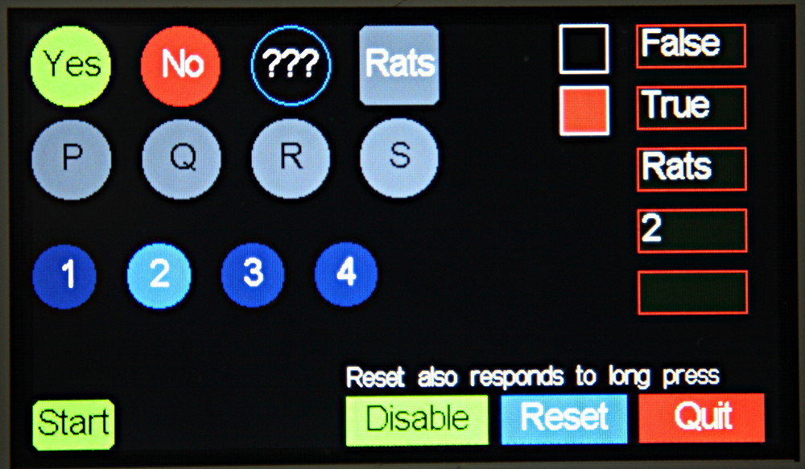
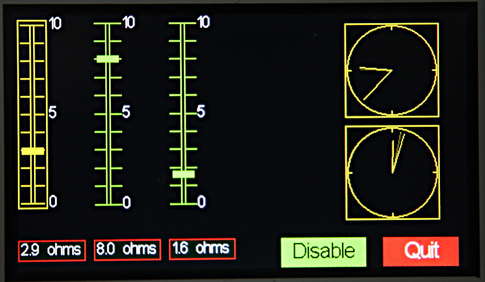
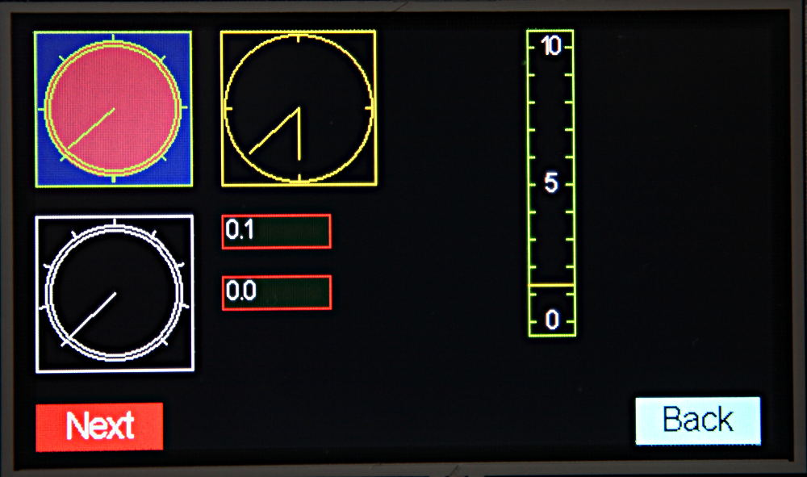
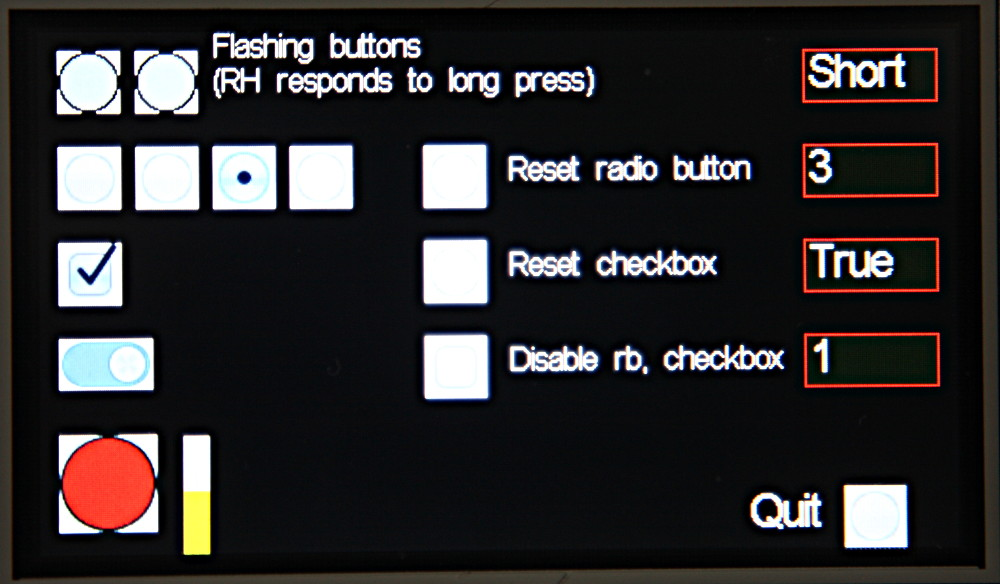
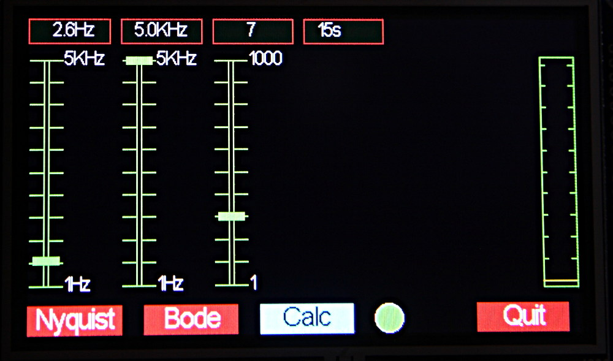
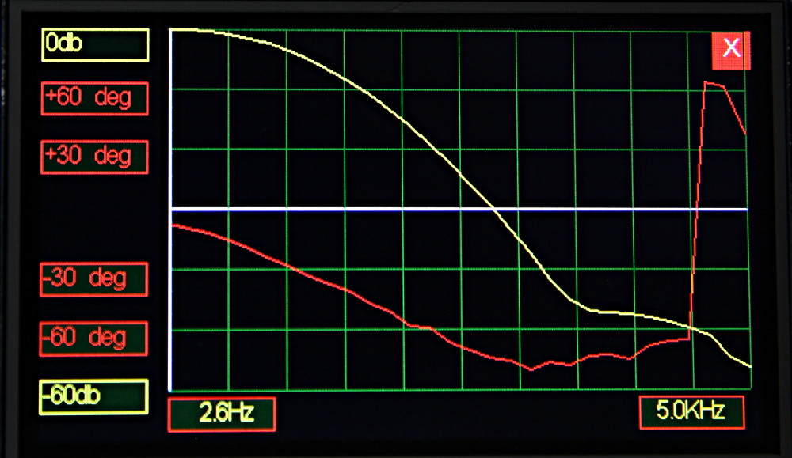
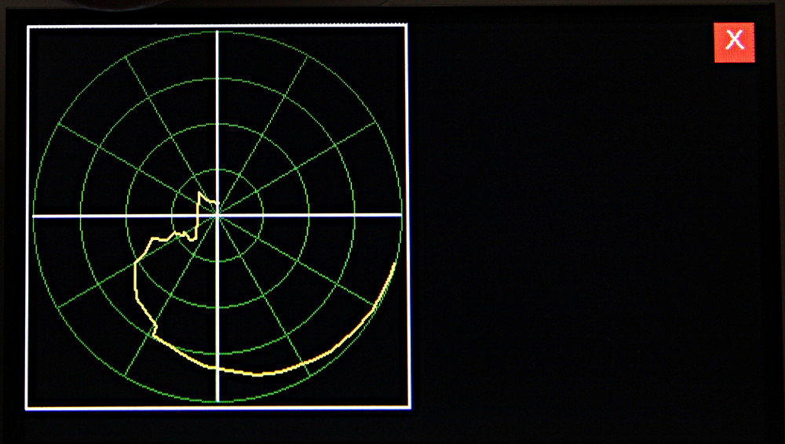

#Sample Images

These are based on the 4.3 inch display.

#Puhbuttons

#Vertical sliders

#Horizontal sliders

#Rotary controls and displays

#Icon Controls

#Modal Dialog Box

#Plot Module

These images are of a proof-of-concept of using the Pyboard to generate a sine
wave and using the ADC's to read the response of the network under test.

##Control Panel

##Bode Plot (Cartesian graph)

##Nyquist Plot (Polar graph)

To anyone interested in this project this was a lash-up with the network (a two
pole passive filter) wired between a DAC output and an ADC input. A serious
solution would require I/O electronics which I have designed but not implemented
to date. The dynamic range could be substantially improved: 60dB was my target.

Note to any MicroPython developers. Would that the firmware supported concurrent
synchronous reading of two ADC's. This would enable phase to be read from an
arbitrary pair of incoming signals. Phase measurements were only possible
because the signal is of a known frequency, constant for the duration of each
reading.
