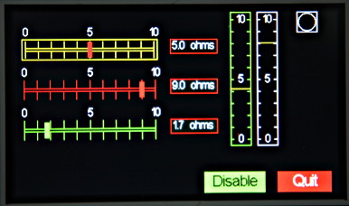

# micropython-gui

Provides a simple touch driven event based GUI interface for the Pyboard when
used with a TFT display. The latter should be based on SSD1963 controller with
XPT2046 touch controller. Such displays are available in electronics stores
[e.g.]( http://www.buydisplay.com/default/) and on eBay. The software is based
on drivers for the TFT and touch controller from Robert Hammelrath. It now uses
uasyncio for scheduling.

It is targeted at hardware control and display applications.



For hardware notes see this [reference](./HARDWARE.md). An extension for
plotting simple graphs is described [here](./PLOT.md).

For sample images, go [here](./IMAGES.md).
A video may be seen [here](http://hinch.me.uk/tft_gui/tft_gui.mp4).

# Release notes (existing users)

Release 0.5 7th Jan 2017. Now uses uasyncio. Requires firmware V1.8.7 or later.
Note that required modules have changed. All modules and test programs should
be updated. Changes to user code are restricted to explicit scheduler calls,
notably shutting down the GUI which is now achieved with ``Screen.shutdown()``.
User defined threads will need to be converted to coroutines with ``async def``
syntax and ``yield`` replaced with ``await``.

Release 0.2 17th Nov 2016. The font file format has changed. This enables fonts
to be created with the ``font_to_py.py`` utility documented
[here](https://github.com/peterhinch/micropython-font-to-py.git).
This Python3 utility converts standard font files to Python source using open
source libraries. To create compatible font files it should be invoked with the
``-x`` argument.

To upgrade to this releaase the new tft.py is required along with new font files.
The supplied fonts are in the new format. User programs should replace

```python
from somefont import somefont
```

with

```python
import somefont
```

All test programs incorporate this change.

# Pre requisites

## Pre installation

Before running the GUI the hardware should be tested. The display may
optionally be calibrated according to the instructions on Robert Hammelrath's
[site](https://github.com/robert-hh/XPT2046-touch-pad-driver-for-PyBoard.git).
Resistive touch panels work best when activated by a stylus or fingernail. They
are also subject to jitter to a degree which varies between display models: the
touch library uses digital filtering to reduce the effect of jitter. This uses
two values ``confidence`` and ``margin`` which may be fine tuned to the unit in
use prior to running the GUI. The optimum values, together with calibration
data, should be stored in the file ``tft_local.py`` listed below.

Users should familiarise themselves with building Micropython from source, and
with the technique for installing Python modules as persistent bytecode.
Instructions on how to do this may be found
[here](http://forum.micropython.org/viewtopic.php?f=6&t=1776).

Some familiarity with callbacks and event driven programming will be of help in
developing applications. The GUI classes are in two categories, those rendered
using icons and those drawn by means of graphics primitives. Either (or both)
may be used in a project.

## Library Documentation

Documentation for the underlying libraries may be found at these sites.  
Robert Hammelrath's drivers:  
[XPT2046 driver](https://github.com/robert-hh/XPT2046-touch-pad-driver-for-PyBoard.git)  
[TFT driver](https://github.com/robert-hh/SSD1963-TFT-Library-for-PyBoard.git)  
Other references:  
[Proposed standard font format](https://github.com/peterhinch/micropython-font-to-py)  
[TFT driver fork](https://github.com/peterhinch/SSD1963-TFT-Library-for-PyBoard.git)
Robert Hammelrath's driver adapted for above font format.  
[uasyncio libraries and notes](https://github.com/peterhinch/micropython-async)  

## Python files

Hardware driver:
 1. TFT_io.py Low level TFT driver.

Library directory:
 1. The uasyncio library must be installed as frozen bytecode. Copy ``lib\*``
 containing the uasyncio installation to your frozen modules directory and
 build.

Core files:
 1. tft.py TFT driver.
 2. touch_bytecode.py Touch panel driver.
 3. asyn.py Synchronisation primitives.
 4. aswitch.py Provides a Delay_ms class for retriggerable delays.
 5. ugui.py The micro GUI library.
 6. tft_local.py Local hardware definition (user defined settings including
 optional calibration  data). This file should be edited to match your hardware.
 7. constants.py Constants such as colors and shapes (import using
 ``from constants import *``)

Optional files used by test programs:
 1. font10.py Font file.
 2. font14.py Ditto.
 3. radiobutton.py Icon file for icon radio buttons
 4. checkbox.py Icon file for icon checkboxes.
 5. iconswitch.py Icon file for an on/off switch.
 6. traffic.py Icons for traffic light button
 7. gauge.py Icons for linear gauge
 8. flash.py Icons for flashing button
 9. threestate.py Icon for 3-state checkbox

Test/demo programs:
 1. vst.py A test program for vertical linear sliders.
 2. hst.py Tests horizontal slider controls, meters and LED.
 3. buttontest.py Pushbuttons and checkboxes.
 4. knobtest.py Rotary controls, a dropdown list, a listbox. Also shows the two
 styles of "greying out" of disabled controls.
 5. screentest.py Test of multiple screens.
 6. dialog.py A modal dialog box.
 7. ibt.py Test of icon buttons.

If you don't intend to use icons, optional files 3-9 and demo 7 may be ignored.

By the standards of the Pyboard this is a large library. Attempts to use it in
the normal way will provoke memory errors owing to heap fragmentation. It is
necessary to 'freeze' core files 1-5 and optional files as persistent bytecode.
tft_local.py may optionally be kept in the filesystem to facilitate adjusting
the ``confidence`` and ``margin`` values for best response. You should plan to
freeze any other fonts and icons you intend to use. The hardware driver listed
above cannot be frozen as it uses inline assembler and Viper code. Test
programs and other small applications need not be frozen.

It is also wise to issue ctrl-D to soft reset the Pyboard before importing a
module which uses the library. The test programs require a ctrl-D before import.

Instructions on creating icon files may be found in the README for the TFT
driver. Fonts should be created using the ``font_to_py.py`` utility documented
[here](https://github.com/peterhinch/micropython-font-to-py.git). The ``-x``
argument should be employed.

# Icons

Most classes use graphics primitives to draw objects on the screen. A few employ icons: this is
arguably prettier but involves large icon files which must be frozen as bytecode. Objects drawn
with graphics primitives are scalable. Further properties such as colors can efficiently be changed
at runtime: to achieve this with an icon-based object would require a set of colored icons to be
created at design time. The library is usable without the icon classes.

Instructions and a utility for creating icon files may be found on Robert Hammelrath's TFT driver
site (see 'Library Documentation' above).

# Concepts

### Terminology

GUI objects are created on a ``Screen`` instance which normally fills the entire physical screen.
Displayable GUI objects comprise ``control`` and ``display`` instances. The former can respond to
touch (e.g. Pushbutton instances) while the latter cannot (LED or Dial instances).

### Coordinates

In common with most displays, the top left hand corner of the display is (0, 0) with increasing
values of x to the right, and increasing values of y downward. Display objects exist within a
rectangular bounding box; in the case of touch sensitive controls this corresponds to the sensitive
region. Locations are defined as a 2-tuple (x, y). The location of an object is defined as the
location of the top left hand corner of the bounding box.

### Colors

These are defined as a 3-tuple (r, g, b) with values of red, green and blue in range 0 to 255. The
interface and this document uses the American spelling (color) throughout for consistency with the
TFT library.

### Callbacks

The interface is event driven. Controls may have optional callbacks which will be executed when a
given event occurs. A callback function receives positional arguments. The first is a reference to
the object raising the callback. Subsequent arguments are user defined, and are specified as a
tuple or list of items. Callbacks are optional, as are the argument lists - a default null
function and empty list are provided. Callbacks are usually bound methods - see the Screens section
for a reason why this is useful.

All controls and displays have a ``tft`` property. This enables callbacks to access drawing
primitives.

### Screens

GUI controls and displays are rendered on a ``Screen`` instance. A user program may instantiate
multiple screens, each with its own set of GUI objects. The ``Screen`` class has class methods
enabling runtime changes of the screen being rendered to the physical display. This enables nested
screens. The feature is demonstrated in ``screentest.py``.

Applications should be designed with a ``Screen`` subclass for each of the application's screens
(even if the app uses only a single screen). This faciitates sharing data between GUI objects on
a screen, and also simplifies the handling of control callbacks. These will be methods bound to
the user screen. They can access the screen's bound variables via ``self`` and the control's bound
methods via the callback's first argument (which is a reference to the control). A simple example
can be seen in the ``KnobScreen`` example in ``screentest.py``.

The ``Screen`` class has two null methods which may be implemented in subclasses: ``on_open`` which
runs when a screen is opened but prior to its display, and ``on_hide`` which runs when a screen
change is about to make the screen disappear. These may be used to instantiate or control threads
and to retrieve the results from a modal dialog box.

The ``Screen`` class is configured in ``tft_local.py``.

# Program Structure

The following illustrates the structure of a minimal program:
```python
from tft_local import setup
import font14
from constants import *
from ugui import Screen, Button
class BaseScreen(Screen):
    def __init__(self):
        super().__init__()
        Button((10, 10), font = font14, fontcolor = BLACK, text = 'Hi')
setup()
Screen.change(BaseScreen)
```

The last line causes the Screen class to instantiate your ``BaseScreen`` and to start the scheduler
using that screen object. Control then passes to the scheduler: the code following this line will
not run until the GUI is shut down and the scheduler is stopped (``Screen.shutdown()``).

# Class Screen

The ``Screen`` class presents a full-screen canvas onto which displayable objects are rendered.
Before instantiating GUI objects a ``Screen`` instance must be created. This will be the current
one until another is instantiated. When a GUI object is instantiated it is associated with the
current screen.

The best way to use the GUI, even in single screen programs, is to create a user screen by
subclassing the ``Screen`` class. GUI objects are instantialited in the constructor after calling
the ``Screen``. This arrangement facilitates communication between objects on the screen. The
following presents the outline of this approach:

```python
def backbutton(x, y):
    def back(button):
        Screen.back()
    Button((x, y), height = 30, font = font14, fontcolor = BLACK, callback = back,
           fgcolor = CYAN,  text = 'Back', shape = RECTANGLE, width = 80)

class Screen_0(Screen):
    def __init__(self):
        super().__init__()
        Label((0, 0), font = font14, width = 400, value = 'Test screen')
        backbutton(390, 242)
setup()
Screen.change(Screen_0)
```

Note that the GUI is started by issuing ``Screen.change`` with the class as its argument rather than
an instance. This assists in multi-screen programs: screens are only instantiated when they are to
be displayed. This allows RAM to be reclaimed by the garbage collector when the screen is closed.

## Class methods

In normal use the following methods only are required:  
 * ``change`` Change screen, refreshing the display. Mandatory positional argument: the new screen
class name. This must be a class subclassed from ``Screen``. The class will be instantiated and
displayed. Optional keyword arguments: ``args``, ``kwargs``: arguments for the class constructor.
 * ``back`` Restore previous screen.
 * ``shutdown`` Clear the screen and shut down the GUI.
 * ``set_grey_style`` Sets the way in which disabled ('greyed-out') objects are displayed. The colors
of disabled objects are dimmed by a factor and optionally desaturated (turned to shades of grey).
Optional keyword arguments: ``desaturate`` default ``True`` and ``factor`` default 2. A
``ValueError`` will result if ``factor`` is <= 1. The default style is to desaturate and dim by a
factor of 2.

Other method:  
 * ``get_tft`` Return the ``TFT`` instance. This allows direct drawing to the physical screen.
Anything so drawn will be lost when the screen is changed. In normal use the ``TFT`` instance is
acquired via a GUI object's ``tft`` property.

See screentest.py and dialog.py for examples of multi-screen design.

## Constructor

This takes no arguments.

## Methods

These do nothing, and are intended to be defined in subclasses if required.

 * ``on_open`` Called when a screen is displayed.
 * ``on_hide`` Called when a screen ceases to be current.

# Display Classes

These classes provide ways to display data and are not touch sensitive.

## Class Label

Displays text in a fixed length field. The height of a label is determined by the metrics of the
specified font.

Constructor mandatory positional argument:
 1. ``location`` 2-tuple defining position.

Keyword only arguments:  
 * ``font`` Mandatory. Font object to use.
 * ``width`` The width of the object in pixels. Default: ``None`` - width is determined from the
 dimensions of the initial text.
 * ``border`` Border width in pixels - typically 2. If omitted, no border will be drawn.
 * ``fgcolor`` Color of border. Defaults to system color.
 * ``bgcolor`` Background color of object. Defaults to system background.
 * ``fontcolor`` Text color. Defaults to system text color.
 * ``value`` Initial text. Default: ``None``.

Method:
 * ``value`` Argument ``val`` string, default ``None``. If provided, refreshes the label with the
 passed text otherwise clears the text in the label.

## Class Dial

Displays angles in a circular dial. Angles are in radians with zero represented by a vertical
pointer. Positive angles appear as clockwise rotation of the pointer. The object can display
multiple angles using pointers of differing lengths (e.g. clock face).

Constructor mandatory positional argument:
 1. ``location`` 2-tuple defining position.

Keyword only arguments (all optional):  
 * ``height`` Dimension of the square bounding box. Default 100 pixels.
 * ``fgcolor`` Color of border. Defaults to system color.
 * ``bgcolor`` Background color of object. Defaults to system background.
 * ``border`` Border width in pixels - typically 2. If omitted, no border will be drawn.
 * ``pointers`` Tuple of floats in range 0 to 0.9. Defines the length of each pointer as a
 proportion of the dial diameter. Default (0.9,) i.e. one pointer of length 0.9.
 * ``ticks`` Defines the number of graduations around the dial. Default 4.

Method:
 * ``value`` Arguments: ``angle`` (mandatory), ``pointer`` (optional) the pointer index. Displays
 an angle. A ``ValueError`` will be raised if the pointer index exceeds the number of pointers
 defined by the constructor ``pointers`` argument.

## Class LED

Displays a boolean state. Can display other information by varying the color.

Constructor mandatory positional argument:
 1. ``location`` 2-tuple defining position.

Keyword only arguments (all optional):
 * ``height`` Dimension of the square bounding box. Default 30 pixels.
 * ``fgcolor`` Color of border. Defaults to system color.
 * ``bgcolor`` Background color of object. Defaults to system background.
 * ``border`` Border width in pixels - typically 2. If omitted, no border will be drawn.
 * ``color`` The color of the LED. Default RED.

Methods:
 * ``value`` Argument ``val`` boolean, default ``None``. If provided, lights or extinguishes the
 LED. Always returns its current state.
 * ``color`` Argument ``color``. Change the LED color without altering its state.

## Class Meter

This displays a single value in range 0.0 to 1.0 on a vertical linear meter.

Constructor mandatory positional argument:
 1. ``location`` 2-tuple defining position.

Keyword only arguments:
 * ``height`` Dimension of the bounding box. Default 200 pixels.
 * ``width`` Dimension of the bounding box. Default 30 pixels.
 * ``font`` Font to use in any legends. Default: ``None`` No legends will be displayed.
 * ``legends`` A tuple of strings to display on the centreline of the meter. These should be
 short to physically fit. They will be displayed equidistantly along the vertical scale, with
 string 0 at the bottom. Default ``None``: no legends will be shown.
 * ``divisions`` Count of graduations on the meter scale. Default 10.
 * ``fgcolor`` Color of border. Defaults to system color.
 * ``bgcolor`` Background color of object. Defaults to system background.
 * ``fontcolor`` Text color. Defaults to system text color.
 * ``pointercolor`` Color of meter pointer. Defaults to ``fgcolor``.
 * ``value`` Initial value to display. Default 0.

Methods:
 * ``value`` Optional argument ``val``. If provided, refreshes the meter display with a new value.
 Range 0.0 to 1.0: out of range values will be constrained to full scale or 0. Always returns its
 current value. 

## Class IconGauge

This can display any one of a set of icons at a location. The icon to be displayed can be selected
by an integer index. Alternatively a float in range 0.0 to 1.0 can be displayed: the control shows
the nearest icon.

Constructor mandatory positional argument:
 1. ``location`` 2-tuple defining position.

Mandatory keyword only argument:
 * ``icon_module`` The name of the (already imported) icon file.

Optional keyword only argument:
 * ``initial_icon`` Default 0. The index of the initial icon to be displayed.

Methods:
 * ``icon`` Mandatory argument: index of an icon. Displays that icon.
 * ``value`` Optional argument ``val``. Range 0.0 to 1.0. If provided, selects the nearest icon and
 displays it. Always returns the control's current value.

# Control Classes

These classes provide touch-sensitive objects capable of both the display and entry of data. If the
user moves the control, its value will change and an optional callback will be executed. If another
control's callback or a thread alters a control's value, its appearance will change to reflect this.

Buttons and checkboxes are provided in two variants, one drawn using graphics primitives, and the
other using icons.

## Class Slider

These emulate linear potentiometers. Vertical ``Slider`` and horizontal ``HorizSlider`` variants
are available. These are constructed and used similarly. The short forms (v) or (h) are used below
to identify these variants. See the note above on callbacks.

Constructor mandatory positional argument:
 1. ``location`` 2-tuple defining position.

Optional keyword only arguments:
 * ``font`` Font to use for any legends. Default ``None``: no legends will be drawn.
 * ``height`` Dimension of the bounding box. Default 200 pixels (v), 30 (h).
 * ``width`` Dimension of the bounding box. Default 30 pixels (v), 200 (h).
 * ``divisions`` Number of graduations on the scale. Default 10.
 * ``legends`` A tuple of strings to display near the slider. These ``Label`` instances will be
 distributed evenly along its length, starting at the bottom (v) or left (h).
 * ``fgcolor`` Color of foreground (the control itself). Defaults to system color.
 * ``bgcolor`` Background color of object. Defaults to system background.
 * ``fontcolor`` Text color. Defaults to system text color.
 * ``slidecolor`` Color for the slider. Defaults to the foreground color.
 * ``border`` Width of border. Default ``None``: no border will be drawn. If a value (typically 2)
 is provided, a border line will be drawn around the control.
 * ``cb_end`` Callback function which will run when the user stops touching the control.
 * ``cbe_args`` A list or tuple of arguments for the above callback. Default ``[]``.
 * ``cb_move`` Callback function which will run when the user moves the slider or the value is
 changed programmatically.
 * ``cbm_args`` A list or tuple of arguments for the above callback. Default ``[]``.
 * ``value`` The initial value. Default 0.0: slider will be at the bottom (v), left (h).

Methods:
 * ``greyed_out`` Optional boolean argument ``val`` default ``None``. If ``None`` returns the
 current 'greyed out' status of the control. Otherwise enables or disables it, showing it in its
 new state.
 * ``value`` Optional arguments ``val`` (default ``None``). If supplied the slider moves to reflect
 the new value and the ``cb_move`` callback is triggered. The method constrains the range to 0.0 to
 1.0. Always returns the control's value.
 * ``color`` Mandatory arg ``color`` The control is rendered in the selected color. This supports
 dynamic color changes  

## Class Knob

This emulates a rotary control capable of being rotated through a predefined arc.

Constructor mandatory positional argument:
 1. ``location`` 2-tuple defining position.

Optional keyword only arguments:
 * ``height`` Dimension of the square bounding box. Default 100 pixels.
 * ``arc`` Amount of movement available. Default 2*PI radians (360 degrees).
 * ``ticks`` Number of graduations around the dial. Default 9.
 * ``fgcolor`` Color of foreground (the control itself). Defaults to system color.
 * ``bgcolor`` Background color of object. Defaults to system background.
 * ``color`` Fill color for the control knob. Default: no fill.
 * ``border`` Width of border. Default ``None``: no border will be drawn. If a value (typically 2)
 is provided, a border line will be drawn around the control.
 * ``cb_end`` Callback function which will run when the user stops touching the control.
 * ``cbe_args`` A list or tuple of arguments for the above callback. Default ``[]``.
 * ``cb_move`` Callback function which will run when the user moves the knob or the value is
 changed.
 * ``cbm_args`` A list or tuple of arguments for the above callback. Default ``[]``.
 * ``value`` Initial value. Default 0.0: knob will be at its most counter-clockwise position.

Methods:
 * ``greyed_out`` Optional boolean argument ``val`` default ``None``. If ``None`` returns the
 current 'greyed out' status of the control. Otherwise enables or disables it, showing it in its
 new state.
 * ``value`` Optional argument ``val``. If set, adjusts the pointer to correspond to the new value.
 The move callback will run. The method constrains the range to 0.0 to 1.0. Always returns the
 control's value.

## Class Checkbox

Drawn using graphics primitives. This provides for boolean data entry and display. In the ``True``
state the control can show an 'X' or a filled block of color.

Constructor mandatory positional argument:
 1. ``location`` 2-tuple defining position.

Optional keyword only arguments:
 * ``height`` Dimension of the square bounding box. Default 30 pixels.
 * ``fillcolor`` Fill color of checkbox when ``True``. Default ``None``: an 'X' will be drawn.
 * ``fgcolor`` Color of foreground (the control itself). Defaults to system color.
 * ``bgcolor`` Background color of object. Defaults to system background.
 * ``border`` Width of border. Default ``None``: no border will be drawn. If a value (typically 2)
 is provided, a border line will be drawn around the control.
 * ``callback`` Callback function which will run when the value changes.
 * ``args`` A list or tuple of arguments for the above callback. Default ``[]``.
 * ``value`` Initial value. Default ``False``.

Methods:
 * ``greyed_out`` Optional boolean argument ``val`` default ``None``. If ``None`` returns the
 current 'greyed out' status of the control. Otherwise enables or disables it, showing it in its
 new state.
 * ``value`` Optional boolean argument ``val``. If the provided value does not correspond to the
 control's current value, updates it; the checkbox is re-drawn and the callback executed. Always
 returns the control's value.

## Class Button

Drawn using graphics primitives. This emulates a pushbutton, with a callback being executed each
time the button is pressed. Buttons may be any one of three shapes: ``CIRCLE``, ``RECTANGLE`` or
``CLIPPED_RECT``.

Constructor mandatory positional argument:
 1. ``location`` 2-tuple defining position.

Mandatory keyword only argument:
 * ``font`` Font for button text

Optional keyword only arguments:
 * ``shape`` CIRCLE, RECTANGLE or CLIPPED_RECT. Default CIRCLE.
 * ``height`` Height of the bounding box. Default 50 pixels.
 * ``width`` Width of the bounding box. Default 50 pixels.
 * ``fill`` Boolean. If ``True`` the button will be filled with the current ``fgcolor``.
 * ``fgcolor`` Color of foreground (the control itself). Defaults to system color.
 * ``bgcolor`` Background color of object. Defaults to system background.
 * ``fontcolor`` Text color. Defaults to system text color.
 * ``litcolor`` If provided the button will display this color for one second after being pressed.
 * ``text`` Shown in centre of button. Default: an empty string.
 * ``callback`` Callback function which runs when button is pressed.
 * ``args`` A list of arguments for the above callback. Default ``[]``.
 * ``onrelease`` Default ``True``. If ``True`` the callback will occur when the button is released
 otherwise it will occur when pressed.
 * ``lp_callback`` Callback to be used if button is to respond to a long press. Default ``None``.
 * ``lp_args`` A list of arguments for the above callback. Default ``[]``.

Method:
 * ``greyed_out`` Optional boolean argument ``val`` default ``None``. If ``None`` returns the
 current 'greyed out' status of the control. Otherwise enables or disables it, showing it in its
 new state.

Class variables:
 * ``lit_time`` Period in seconds the ``litcolor`` is displayed. Default 1.
 * ``long_press_time`` Press duration for a long press. Default 1 second.

## Class ButtonList: emulate a button with multiple states

Drawn using graphics primitives.

A ``ButtonList`` groups a number of buttons together to implement a button which moves between
states each time it is pressed. For example it might toggle between a green Start button and a red
Stop button. The buttons are defined and added in turn to the ``ButtonList`` object. Typically they
will be the same size, shape and location but will differ in color and/or text. At any time just
one of the buttons will be visible, initially the first to be added to the object.

Buttons in a ``ButtonList`` should not have callbacks. The ``ButtonList`` has its own user supplied
callback which will run each time the object is pressed. However each button can have its own list
of ``args``. Callback arguments comprise the currently visible button followed by its arguments.

Constructor argument:
 * ``callback`` The callback function. Default does nothing.

Methods:
 * ``add_button`` Adds a button to the ``ButtonList``. Arguments: as per the ``Button`` constructor.
 Returns the button object.
 * ``greyed_out`` Optional boolean argument ``val`` default ``None``. If ``None`` returns the
 current 'greyed out' status of the control. Otherwise enables or disables it, showing it in its
 new state.
 * ``value`` Optional argument: a button in the set. If supplied and the button is not active the
 currency changes to the supplied button and its callback is run. Always returns the active button.

Typical usage is as follows:
```python
def callback(button, arg):
    print(arg)

table = [
     {'fgcolor' : GREEN, 'shape' : CLIPPED_RECT, 'text' : 'Start', 'args' : ['Live']},
     {'fgcolor' : RED, 'shape' : CLIPPED_RECT, 'text' : 'Stop', 'args' : ['Die']},
]
bl = ButtonList(callback)
for t in table: # Buttons overlay each other at same location
    bl.add_button((10, 10), font = font14, fontcolor = BLACK, **t)
```

## Class RadioButtons

Drawn using graphics primitives.

These comprise a set of buttons at different locations. When a button is pressed, it becomes
highlighted and remains so until another button is pressed. A callback runs each time the
current button is changed.

Constructor positional arguments:
 * ``highlight`` Color to use for the highlighted button. Mandatory.
 * ``callback`` Callback when a new button is pressed. Default does nothing.
 * ``selected`` Index of initial button to be highlighted. Default 0.

Methods:
 * ``add_button`` Adds a button. Arguments: as per the ``Button`` constructor. Returns the Button
 instance.
 * ``greyed_out`` Optional boolean argument ``val`` default ``None``. If ``None`` returns the
 current 'greyed out' status of the control. Otherwise enables or disables it, showing it in its
 new state.
 * ``value`` Optional argument: a button in the set. If supplied, and the button is not currently
 active, the currency changes to the supplied button and its callback is run. Always returns the
 currently active button.

Typical usage:
```python
def callback(button, arg):
    print(arg)

table = [
    {'text' : '1', 'args' : ['1']},
    {'text' : '2', 'args' : ['2']},
    {'text' : '3', 'args' : ['3']},
    {'text' : '4', 'args' : ['4']},
]
x = 0
rb = RadioButtons(callback, BLUE) # color of selected button
for t in table:
    rb.add_button((x, 180), font = font14, fontcolor = WHITE,
                    fgcolor = LIGHTBLUE, height = 40, **t)
    x += 60 # Horizontal row of buttons
```

## Class IconButton (also checkbox)

Drawn using an icon file which must be imported before instantiating. A checkbox may be implemented
by setting the ``toggle`` argument ``True`` and using an appropriate icon file. An ``IconButton``
instance has a state representing the index of the current icon being displayed. User callbacks can
interrogate this by means of the ``value`` method described below.

Constructor mandatory positional argument:
 1. ``location`` 2-tuple defining position.

Mandatory keyword only argument:
 * ``icon_module`` Name of the imported icon module.

Optional keyword only arguments:
 * ``flash`` Numeric, default 0. If ``value`` > 0, button will display icon[1] for ``value`` secs.
 * ``toggle`` Boolean, default False. If True, each time the button is pressed it will display each
 icon in turn (modulo number of icons in the module).
 * ``state`` Initial button state (index of icon displayed). Default 0.
 * ``callback`` Callback function which runs when button is pressed. Default does nothing.
 * ``args`` A list of arguments for the above callback. Default ``[]``.
 * ``onrelease`` Default ``True``. If ``True`` the callback will occur when the button is released.
 * ``lp_callback`` Callback to be used if button is to respond to a long press. Default ``None``.
 * ``lp_args`` A list of arguments for the above callback. Default ``[]``.

Methods:
 * ``greyed_out`` Optional boolean argument ``val`` default ``None``. If ``None`` returns the
 current 'greyed out' status of the control. Otherwise enables or disables it. If greyed out, the
 button is displayed with colors dimmed.
 * ``value`` Argument ``val`` default ``None``. If the argument is provided and is a valid index
 not corresponding to the current button state, changes the button state and displays that icon.
 The callback will be executed. Always returns the button state (index of the current icon being
 displayed).

Class variables:
 * ``long_press_time`` Press duration for a long press. Default 1 second.

## Class IconRadioButtons

Drawn using an icon file which must be imported before instantiating. These comprise a set of
buttons at different locations. When initially drawn, all but one button will be in state 0
(i.e. showing icon[0]). The selected button will be in state 1. When a button in state 0 is
pressed, the set of buttons changes state so that it is the only one in state 1 (showing
icon[1]). A callback runs each time the current button changes.

Constructor positional arguments:
 * ``callback`` Callback when a new button is pressed. Default does nothing.
 * ``selected`` Index of initial button to be highlighted. Default 0.

Methods:
 * ``add_button`` Adds a button to the set. Arguments: as per the ``IconButton`` constructor.
 Returns the button instance.
 * ``value`` Argument ``val`` default ``None``. If the argument is provided which is an inactive
 button in the set, that button becomes active and the callback is executed. Always returns the
 button which is currently active.

## Class Listbox

Constructor mandatory positional argument:
 1. ``location`` 2-tuple defining position.

Mandatory keyword only arguments:
 * ``font``
 * ``elements`` A list or tuple of strings to display. Must have at least one entry.

Optional keyword only arguments:
 * ``width`` Control width in pixels, default 250.
 * ``value`` Index of currently selected list item. Default 0.
 * ``border`` Space between border and contents. Default 2 pixels. If ``None`` no border will be
 drawn.
 * ``fgcolor`` Color of foreground (the control itself). Defaults to system color.
 * ``bgcolor`` Background color of object. Defaults to system background.
 * ``fontcolor`` Text color. Defaults to system text color.
 * ``select_color`` Background color for selected item in list. Default ``LIGHTBLUE``.
 * ``callback`` Callback function which runs when a list entry is picked.
 * ``args`` A list of arguments for the above callback. Default ``[]``.

Methods:
 * ``value`` Argument ``val`` default ``None``. If the argument is provided which is a valid index
 into the list that entry becomes current and the callback is executed. Always returns the index
 of the currently active entry.
 * ``textvalue`` Argument ``text`` a string default ``None``. If the argument is provided and is in
 the control's list, that item becomes current. Returns the current string, unless the arg was
 provided but did not correspond to any list item. In this event the control's state is not changed
 and ``None`` is returned.


## Class Dropdown

A dropdown list. The list, when active, is drawn below the control. The height of the control is
determined by the height of the font in use.

Constructor mandatory positional argument:
 1. ``location`` 2-tuple defining position.

Mandatory keyword only arguments:
 * ``font``
 * ``elements`` A list or tuple of strings to display. Must have at least one entry.

Optional keyword only arguments:
 * ``width`` Control width in pixels, default 250.
 * ``value`` Index of currently selected list item. Default 0.
 * ``fgcolor`` Color of foreground (the control itself). Defaults to system color.
 * ``bgcolor`` Background color of object. Defaults to system background.
 * ``fontcolor`` Text color. Defaults to system text color.
 * ``select_color`` Background color for selected item in list. Default ``LIGHTBLUE``.
 * ``callback`` Callback function which runs when a list entry is picked.
 * ``args`` A list of arguments for the above callback. Default ``[]``.

Methods:
 * ``value`` Argument ``val`` default ``None``. If the argument is provided which is a valid index
 into the list that entry becomes current and the callback is executed. Always returns the index
 of the currently active entry.
 * ``textvalue`` Argument ``text`` a string default ``None``. If the argument is provided and is in
 the control's list, that item becomes current. Returns the current string, unless the arg was
 provided but did not correspond to any list item. In this event the control's state is not changed
 and ``None`` is returned.

# Dialog Boxes

In general ``Screen`` objects occupy the entire physical display. The principal exception to this
is modal dialog boxes: these are rendered in a window which accepts all touch events until it is
closed. Dialog boxes are created by instantiating an ``Aperture`` which is a ``Screen`` superclass.
In effect this is a window, but a 'micro' implementation lacking chrome beyond a simple border and
occupying a fixed location on the screen.

In use the user program creates a class subclassed from ``Aperture``. This is populated in the same
way as per ``Screen`` subclasses. The class name can then be passed to ``Screen.change`` to invoke
the dialog box. The GUI provides a simple way to build dialog boxes based on a small set of
pushbuttons such as 'Yes/No/Cancel' in the form of the ``DialogBox`` class.

A convenience method ``locn`` is provided to assist in populating dialog boxes. Given coordinates
relative to the dialog box, it provides an absolute ``location`` 2-tuple suitable as a constructor
argument for ``control`` or ``display`` classes. See ``dialog.py`` for example usage.

## Class Aperture

Provides a window for objects in a modal dialog box.

Constructor mandatory positional args:  
 1. ``location`` 2-tuple defining the window position.
 2. ``height`` Dimensions in pixels.
 3. ``width``

Optional keyword only args:  
 * ``draw_border`` Boolean, default ``True``. If set a single pixel window border will be drawn.
 * ``bgcolor``  Background color of window. Defaults to system background.
 * ``fgcolor`` Color of border. Defaults to system foreground.

Instance variables:  
 * ``location`` 2-tuple defining the window position.
 * ``height`` Dimensions in pixels.
 * ``width``

Method:
 * ``locn`` Args: x, y. Returns an absolute location 2-tuple given a pair of coordinates relative
 to the dialog box.

Class method:  
 * ``value`` Optional arg ``val`` default ``None``. Provides a mechanism for returning the outcome
 of a dialog box which can be queried by the calling object. If the arg is provided, the value is
 set. The arg may be any Python object. Returns the value of the ``Aperture`` class. The calling
 ``Screen`` can query this by implementing an ``on_open`` method which calls ``Aperture.value()``.

## Class DialogBox

Simplifies building simple dialog boxes based on a set of pushbuttons. Any button press will close
the dialog. The caller can determine which button was pressed. The size of the buttons and the
width of the dialog box are calculated from the strings assigned to the buttons. This ensures that
buttons are evenly spaced and identically sized.

Constructor mandatory positional args:
 1. ``font`` The font for buttons and label.
 
Optional keyword only args:  
 * ``elements`` A list or tuple of 2-tuples. Each defines the text and color of a pushbutton, e.g.
 ``(('Yes', RED), ('No', GREEN))``.
 * ``location`` 2-tuple defining the dialog box location. Default (20, 20).
 * ``label`` Text for an optional label displayed in the centre of the dialog box. Default ``None``.
 * ``bgcolor`` Background color of window. Default ``DARKGREEN``.
 * ``buttonwidth`` Minimum width of buttons. Default 25. In general button dimensions are
 calculated from the size of the strings in ``elements``.  
 * ``closebutton`` Boolean. If set, a ``close`` button will be displayed at the top RH corner of
 the dialog box.

Pressing any button closes the dialog and sets the ``Aperture`` value to the text of the button
pressed or 'Close' in the case of the ``close`` button.

# Developer Notes

The ``ugui`` module is large by Pyboard standards. This presents no problem if frozen, but if you
wish to modify it, freezing is cumbersome. Compiling it on the Pyboard will result in memory
errors. The solution is to cross-compile, replacing ugui.py with ugui.mpy on the target. This will
work with small test programs such as those supplied. Alternatively you may opt to split the module
into two.

For developers wishing to extend the library with new controls or displays, see this [reference](./DEVELOPER.md).
